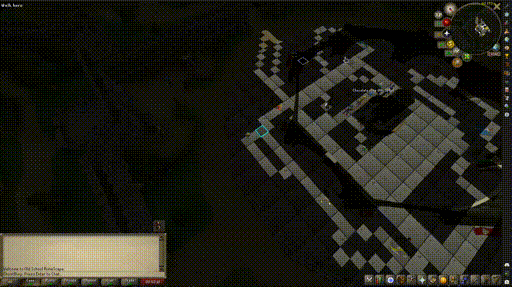

Keep track of your path as you travel through Gielinor!

# Gielinor Explored plugin 
A plugin for [Runelite](https://runelite.net/) that adds a fog of war effect to the game's map, revealing areas as you explore them. 

# Screenshots
### Moving Through The World

### World Map & Config

## Contributing

Contributions are welcome! Please feel free to submit a Pull Request. For major changes, please open an issue first to discuss what you would like to change.

## License

This project is licensed under the BSD-2-Clause License - see the LICENSE file for details.

## Acknowledgments
- Built for the [RuneLite](https://runelite.net/) client
- Uses the RuneLite API for plugin development
- Portions adapted from [Tileman-Mode](https://github.com/ConorLeckey/Tileman-Mode) (BSD 2-Clause), including tile storage and movement pathing logic
---

